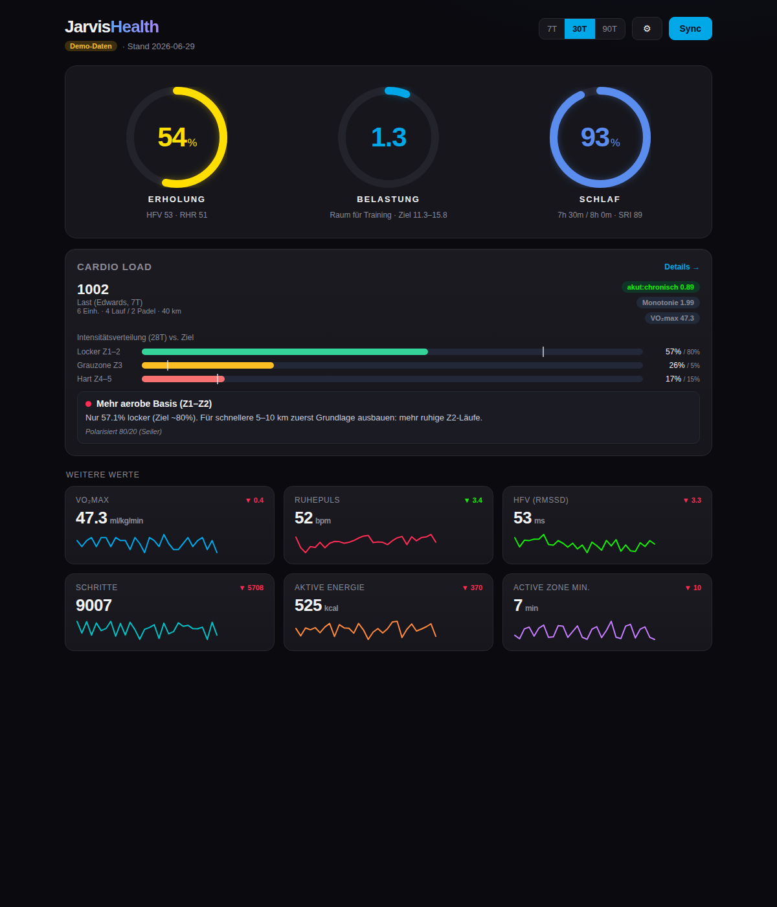
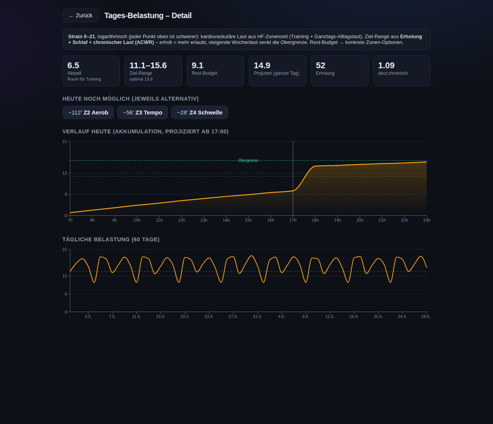

# JarvisHealth

Ein lokales, modernes Dark-Mode-Dashboard für deine Fitbit-/Google-Health-Daten
mit **wissenschaftlich fundierten** Eigenberechnungen.

**Oberfläche:** aufgeräumter, einspaltiger Feed im Bevel-Stil – eine Metrik pro
Karte (großer Wert + Sparkline + 1 Satz Klartext), Tap öffnet die Detailansicht.
Zusätzliche Karten: VO₂max, Ruhepuls, HFV, Schritte, aktive Energie, Active Zone
Minutes. Der **Strain** nutzt echte **Ganztags-Minuten-HF** — für Historie wie
Live-Kurve dasselbe persönliche LTHR-Zonensystem — und prognostiziert den Rest
des Tages aus deinem typischen Tagesprofil.

Kernmetriken:

- **Erholung** – lnRMSSD vs. 60-Tage-Baseline ±SWC + 7-Tage-Trend/CV, gewichtet
  mit Schlaf-HF und Schlaf; Temp/Atmung/SpO₂ als Anomalie-Flags.
- **Tages-Belastung (Strain 0–21)** – logarithmische kardiovaskuläre Last über
  den Tag, mit Ziel-Range (aus Erholung+Schlaf+chronischer Last) und Rest-Budget
  inkl. konkreter Zonen-Optionen ("noch ~X′ Z2 oder ~Y′ Z4").
- **Schlaf** – Sleep Regularity Index (SRI) als Top-Komponente + Dauer/Effizienz/
  Tief/REM/Latenz/WASO; automatischer Schlafbedarf + Defizit.
- **Cardio Load** – schwellen-basierte HF-Zonen (LTHR), Edwards-Zonen-TRIMP +
  sRPE, EWMA-Last/Monotonie, polarisierte Zielverteilung und erholungs-validierte
  Trainingsempfehlungen für dein 5–10 km-Ziel (inkl. Padel).

Jede Karte ist anklickbar → Detailansicht. Backend: FastAPI + SQLite. Frontend:
React + Vite + Recharts. Läuft komplett lokal.




---

## 1. Starten — der einfachste Weg (Docker, 3 Befehle)

Standardmäßig läuft alles mit einem **Demo-Provider** (realistische Beispieldaten,
deterministisch). Kein Google-Konto nötig. Voraussetzung: [Docker Desktop](https://www.docker.com/products/docker-desktop/).

```bash
git clone https://github.com/steven4code/steven4code.git jarvishealth && cd jarvishealth
cp backend/.env.example backend/.env
docker compose up --build
```

→ **http://localhost:5173** öffnen. Fertig. Die App synchronisiert beim Start
automatisch. Unter ⚙ kannst du Max-HF, LTHR, Trainingsziel und Schlafbedarf
einstellen — das **Trainingsziel steuert den Ziel-Mix** der Trainingssysteme.

<details>
<summary>Alternative ohne Docker (Python + Node)</summary>

```bash
# Backend (Terminal 1)
cd backend
python3 -m venv .venv && source .venv/bin/activate   # Windows: .venv\Scripts\activate
pip install -r requirements.txt
cp .env.example .env                                   # USE_MOCK_PROVIDER=true
uvicorn app.main:app --reload --port 8000

# Frontend (Terminal 2)
cd frontend
npm install
npm run dev
```
</details>

---

## 1b. Mit Freunden teilen

Kurzfassung: **Deine Freunde brauchen KEINE eigene Google-Cloud-Konfiguration.**
Sie melden sich nur mit ihrem eigenen Google-Konto an — die einmalige
API-Einrichtung machst nur du (der „Host" des OAuth-Clients).

So funktioniert es:

1. **Du (einmalig):** OAuth-Client in der Google Cloud Console anlegen
   (Abschnitt 2 unten) und deine Freunde unter *OAuth consent screen →
   Test users* mit ihrer Gmail-Adresse eintragen (bis zu 100 Testnutzer).
2. **Jeder Freund:** Repo klonen, deine `backend/.env` bekommen (enthält
   `GOOGLE_CLIENT_ID` + `GOOGLE_CLIENT_SECRET`, `USE_MOCK_PROVIDER=false`),
   `docker compose up --build`, dann im Login-Screen **„Mit Google anmelden"**
   mit dem eigenen Konto.
3. Fertig — jede Person sieht ausschließlich die **eigenen** Daten.

Wichtig zu wissen:

- **Jede Person betreibt ihre eigene Instanz** (auf dem eigenen Rechner).
  Die App ist bewusst Single-User: eine lokale SQLite pro Person, alle
  Scores werden lokal berechnet, nichts verlässt den eigenen Rechner.
  Ein gemeinsam gehosteter Server für mehrere Konten ist damit **nicht**
  möglich (dafür bräuchte die App Multi-User-Support).
- Das geteilte Client-Secret ist im Freundeskreis vertretbar (es erlaubt
  nur den Start des Login-Flows; Zugriff auf Daten gibt erst der jeweilige
  Google-Login der Person). Nicht öffentlich posten.
- Im OAuth-**Testing**-Modus laufen Refresh-Tokens nach 7 Tagen ab — dann
  einfach neu anmelden. Für Dauerbetrieb die App in der Cloud Console auf
  **Produktion** stellen (Google-Verifizierung nötig).

---

## 2. Echte Daten anbinden (Google Health API)

Die alte Fitbit Web API wird **9/2026** abgeschaltet; Nachfolger ist die
**Google Health API** (`https://health.googleapis.com/v4/…`, Google OAuth 2.0).
Login-Flow, Token-Speicherung, Auto-Refresh und der REST-Client sind bereits
implementiert – es fehlen nur **deine** Zugangsdaten.

### Schritt 1 – Google Cloud (einmalig, nur du kannst das)
1. Projekt in der [Google Cloud Console](https://console.cloud.google.com/) anlegen.
2. **Google Health API** aktivieren (APIs & Services → Library).
3. **OAuth consent screen**: User type *External*, Status **Testing**, dich als
   **Test user** eintragen. Read-only Health-Scopes hinzufügen.
4. **Credentials → OAuth client ID → Web application**, Redirect-URI
   `http://localhost:8000/auth/callback`. **Client ID + Secret** notieren.

### Schritt 2 – `.env` setzen
```ini
USE_MOCK_PROVIDER=false
GOOGLE_CLIENT_ID=…
GOOGLE_CLIENT_SECRET=…
GOOGLE_REDIRECT_URI=http://localhost:8000/auth/callback
HEALTH_SCOPES=https://www.googleapis.com/auth/googlehealth.health_metrics_and_measurements.readonly https://www.googleapis.com/auth/googlehealth.sleep.readonly https://www.googleapis.com/auth/googlehealth.activity_and_fitness.readonly
```

### Schritt 3 – Anmelden
Backend & Frontend neu starten → im Login-Gate „Mit Google anmelden" → Google-
Consent → zurück zur App → **Sync**.

### ⚠ Vor dem Live-Gang zu prüfen
Die offiziellen Doku-Seiten waren aus der Build-Umgebung nicht abrufbar (Google
liefert 403 an automatisierte Abrufe). Die API-**Struktur** ist korrekt
umgesetzt; bitte die **exakten Werte** gegen die Doku abgleichen — alles an
**einer** Stelle:
- **Scopes**: `developers.google.com/health/scopes` → ggf. `HEALTH_SCOPES` anpassen.
- **Datentyp-Namen** (kebab-case): `developers.google.com/health/data-types` →
  `backend/app/providers/google_health.py` → `DATA_TYPES`.
- **Endpoint/Methode**: `…/v4/users/me/dataTypes/{type}/dataPoints` (list /
  dailyRollUp) ist in `google_health.py` zentralisiert.

Hinweis: Im OAuth-**Testing**-Modus laufen Refresh-Tokens nach 7 Tagen ab
(wöchentlich neu anmelden) – für Dauerbetrieb App auf **Produktion** stellen.

---

## Berechnungslogik (Kurzreferenz)

| Metrik | Kern | Quelle/Standard |
| --- | --- | --- |
| Erholung | Autonomer Kern (lnRMSSD 80 % + Ruhe-HF 20 % vs. 60-T-Baseline ±SWC) × Schlaf-Faktor 0,70–1,00; 7-T-Trend/CV; Temp/Atmung/SpO₂ deckeln auf 50 | Plews 2013; Buchheit 2014 |
| Belastung 0–100 | Banister-TRIMP aus Ganztags-Minuten-HF (Ruhe ≈ 0); Skala adaptiv auf die eigene 60-T-Verteilung (90.-Perzentil-Tag ≈ 85); Zielband aus Erholung+Schlaf+ACWR; Rest ab „jetzt" als **Prognose** aus dem 28-T-Median-Tagesprofil | Banister 1991; Edwards 1993; Gabbett 2016 |
| Schlaf | SRI (30 %) + Dauer/Effizienz/Tief/REM/Latenz/WASO; Auto-Bedarf (7–8 h) + 14-T-Defizit; lastadaptive Tiefschlaf-Ziele | Phillips 2017; Windred 2024; Driver & Taylor 2000 |
| Training | Lauf-Äquivalent-Minuten (Spezifität je Modalität: Fußball > Padel); **Ziel-Mix folgt dem Trainingsziel** (polarisiert 80/5/15 …); **Grauzone = Deckel**, kein Soll; Wochensoll chronisch + Rampe (max. +10 %/Wo) Richtung Ziel-Anker; EWMA-ACWR + Monotonie; bei niedriger Erholung → Ruhe | Seiler; Tanaka 1994; Krustrup; Foster 1998; Williams 2017 |

**Zonen-Konsistenz (Live-Betrieb):** Alle Tage — Historie wie Live-Kurve —
werden aus dem **Minuten-Puls-Stream** mit deinen persönlichen LTHR-Zonen
berechnet; Googles LIGHT…PEAK-Rollups dienen nur als Fallback für Tage ohne
HF-Samples. Damit sind τ-Eichung und Tagesvergleiche im selben Zonensystem.

Details inkl. Formeln stehen als Kommentare in `backend/app/services/`
(`recovery.py`, `strain.py`, `sleep.py`, `cardio.py`, `profile.py`).

## Projektstruktur
```
backend/app/
  providers/   mock.py · google_health.py (DATA_TYPES/Scopes hier anpassen)
  services/    recovery · strain · sleep · cardio · profile · dashboard · sync
  routers/     auth · sync · metrics (+ /detail/*) · profile
frontend/src/
  App.jsx      Layout + Navigation (JarvisHealth)
  components/   RecoveryHero · StrainPanel · SleepCard · CardioCard · *Detail · Settings · StrainGauge
```

## Datenschutz
Nur Lesen (`*.readonly`, GET). Alle Scores werden **lokal** berechnet, nichts
wird zu Google zurückgeschrieben. Daten/Tokens bleiben in deiner lokalen SQLite.
